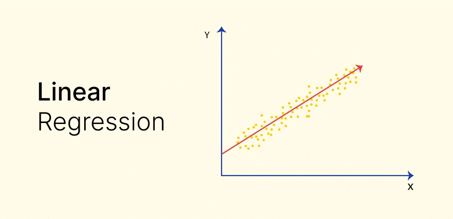

# Linear regression cho dự đoán điểm của sinh viên dựa trên dữ liệu cá nhân và học tập

# Giới thiệu
Linear regression (hồi quy tuyến tính) là một phương pháp thống kê được sử dụng để mô hình hóa mối quan hệ giữa một biến phụ thuộc (y) và một hoặc nhiều biến độc lập (x). Mục tiêu của hồi quy tuyến tính là tìm ra một đường thẳng (hoặc siêu phẳng trong trường hợp nhiều biến độc lập) sao cho sự khác biệt giữa giá trị thực tế và giá trị dự đoán từ mô hình là nhỏ nhất.

# Quy trình thực hiện
1. Thu thập dữ liệu
2. Khám phá và phân tích dữ liệu (Exploratory Data Analysis - EDA)
3. Xử lý và chuẩn bị dữ liệu
4. Xây dựng mô hình hồi quy tuyến tính
5. Đánh giá mô hình
6. Dự đoán và áp dụng mô hình
7. Cải thiện mô hình
8. Triển khai mô hình
## Yêu cầu
Để chạy dự án này, bạn cần cài đặt các thư viện sau:
- `numpy` – Thực hiện các phép toán số học cơ bản.
- `pandas` – Quản lý dữ liệu và thao tác với bảng dữ liệu.
- `matplotlib` – Vẽ đồ thị.
- `scikit-learn` – Thực hiện thuật toán hồi quy tuyến tính.
- `seaborn` – Thư viện vẽ đồ thị cho phân tích trực quan.
- `streamlit` – Tạo giao diện.
Bạn có thể cài đặt các thư viện này thông qua pip:
```bash
pip install numpy pandas matplotlib scikit-learn seaborn streamlit
# Coding
X = np.array([train['reading score'].values, train['writing score'].values]).T
one = np.ones((X.shape[0], 1))
Xbar = np.concatenate((one, X), axis=1)

A = np.dot(Xbar.T, Xbar)
b = np.dot(Xbar.T, np.array([train['math score'].values]).T)
w = np.dot(np.linalg.pinv(A), b)

w_0 = w[0][0]
w_1 = w[1][0]
w_2 = w[2][0]

## Cách sử dụng
 **Sử dụng giao diện**:
    - Chạy file `linear.py`:
   ```bash
   streamlit run linear.py
   ```